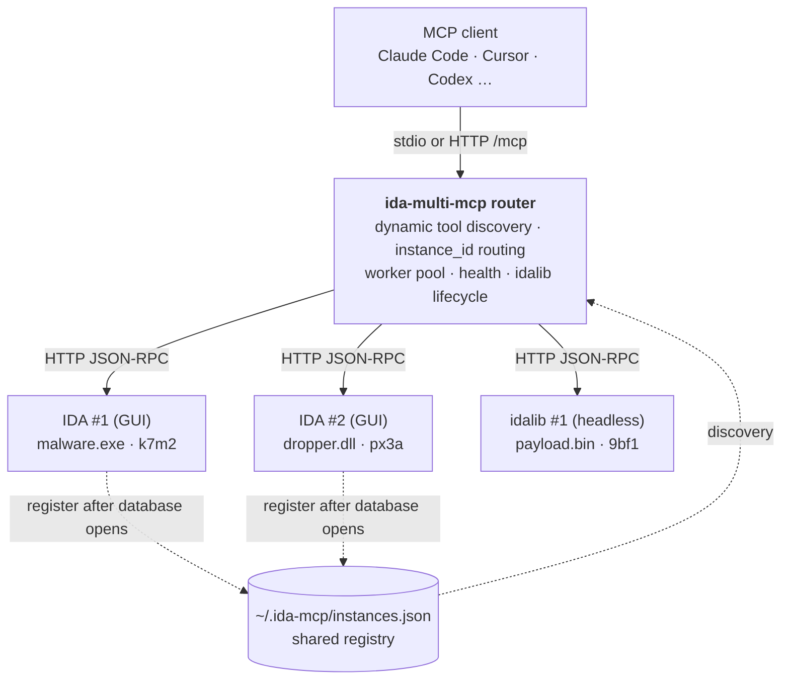

<h1 align="center">ida-multi-mcp</h1>

<p align="center">
  <b>Reverse-engineer several binaries at once — dropper, payload, C2 — through a single MCP endpoint.</b><br>
  Each plugin-equipped IDA Pro database auto-registers when opened · headless idalib sessions · local, stripping-resistant function similarity across binaries.
</p>

<p align="center">
  <a href="https://github.com/MeroZemory/ida-multi-mcp/actions/workflows/ci.yml"></a>
  <a href="#license"></a>
  <a href="#requirements"></a>
  <a href="#requirements"></a>
  <a href="#supported-mcp-clients"></a>
  <a href="https://github.com/MeroZemory/ida-multi-mcp"></a>
</p>

<p align="center">
  <a href="#install-in-one-prompt">Install</a> ·
  <a href="#see-it-in-action">In action</a> ·
  <a href="#why-ida-multi-mcp">Why</a> ·
  <a href="#built-on-ida-pro-mcp">Upstream</a> ·
  <a href="#architecture-at-a-glance">Architecture</a> ·
  <a href="#tool-surface">Tools</a> ·
  <a href="#learn-more">Docs</a>
</p>

---

## Install in one prompt

**Ask your AI agent to install it.** Copy-paste one of these — it matches IDA's Python version, drops the plugin in place, and registers the MCP server with your client.

**Claude Code / Codex:**
> Install and configure ida-multi-mcp by following the instructions here: https://raw.githubusercontent.com/MeroZemory/ida-multi-mcp/main/docs/installation.md

**Cursor:**
> @Web fetch https://raw.githubusercontent.com/MeroZemory/ida-multi-mcp/main/docs/installation.md and follow the installation steps.

Then open your binaries in IDA Pro — instances register themselves — and talk to your agent.
Prefer doing it by hand? See [Manual installation](#manual-installation). Removing it again is in [Troubleshooting](docs/troubleshooting.md#uninstallation).

---

## See it in action

Two binaries open in two IDA windows. One MCP endpoint. No client config per binary.

> *"Which function in dropper.dll is the same as `sub_140001000` in malware.exe?"*

```text
→ list_instances()
  k7m2  malware.exe   x86_64  port 49152
  px3a  dropper.dll   x86_64  port 49153

→ analysis_wait(instance_id="px3a", timeout_sec=200)
  { "finished": true, "functions_added": 12884 }   # 12,884 functions that did not exist a minute ago

→ index_functions(instance_id="k7m2")   ·   index_functions(instance_id="px3a")
  { "indexed": 61044 }                      { "indexed": 73929 }

→ similar_functions(instance_id="k7m2", func="sub_140001000", scope="instances")
  0.94  px3a  sub_18000C120   high     minhash 0.91 · anchors 0.97 · cfg 0.88
  0.71  px3a  sub_18000E440   medium   minhash 0.68 · anchors 0.80 · cfg 0.64

→ decompile(instance_id="px3a", addr="sub_18000C120")
  ...
```

Core instruction, anchor and CFG signals do not use function names, so stripping does not remove them. When both functions have meaningful symbols, pseudocode identifier tokens can also contribute. Scoring and inference run locally; no binary or IDB is uploaded.

---

## Why ida-multi-mcp

<table>
<tr>
<td width="50%" valign="top">

**Built for multi-binary work**

- **Zero-configuration discovery** — every IDA Pro instance running the installed plugin registers into `~/.ida-mcp/instances.json` when a database opens; no per-binary client configuration
- **Genuinely parallel across instances** — requests run on a worker pool. A call to instance B while instance A was busy: **3.41 s → 0.01 s** ([#27](https://github.com/MeroZemory/ida-multi-mcp/pull/27))
- **Headless idalib sessions** — `idalib_open` analyses a binary with no GUI, one isolated subprocess per session
- **Cross-binary similarity (BCSD)** — patch diffing, library-function ID and variant hunting, with local scoring and indexes
- **Short, stable instance IDs** — `k7m2`, `px3a`, with automatic binary-change detection

</td>
<td width="50%" valign="top">

**Built so the agent does not lie to you**

- **Analysis gating** — `analysis_status` / `analysis_wait` tell an agent whether IDA has actually settled, and the router warns on results from analysis-dependent tools while it has not ([why this matters](#the-one-rule-wait-for-auto-analysis))
- **Deadlines that reach into C** — a slow SDK call used to hold IDA's main thread past the tool timeout. The deadline now fires IDA's own `set_cancelled()`, and partial pages are labelled `cursor.cancelled` ([#28](https://github.com/MeroZemory/ida-multi-mcp/pull/28))
- **Actionable failure** — binary changes, stale instances and crashes come back as errors an agent can act on, not silence
- **Localhost by default** — IDA plugins stay loopback-bound with Host/Origin validation; the aggregator is stdio unless you opt into HTTP MCP (`--http`) for a remote client
- **IDA 8.5–9.3** — `compat.py` shims APIs that moved between releases and warns on the builds that shipped without them

</td>
</tr>
</table>

---

## Built on ida-pro-mcp

The IDA tool implementations here come from [ida-pro-mcp](https://github.com/mrexodia/ida-pro-mcp) by [Duncan Ogilvie (mrexodia)](https://github.com/mrexodia), bundled as a package, periodically compared and selectively synchronized. That project is the foundation this one stands on, and fixes flow both ways.

What ida-multi-mcp adds on top:

- a **router** that fronts N IDA processes behind one stdio endpoint, with `instance_id` routing and a worker pool
- **discovery through a shared file registry** — the IDA plugin registers each GUI instance into `~/.ida-mcp/instances.json` when a database opens, so the client needs no per-binary configuration
- **function similarity (BCSD)** and `compare_binaries` for cross-binary work
- **auto-analysis gating** (`analysis_status` / `analysis_wait`) so an agent can tell a partial answer from a complete one

Both projects now support working on several databases at once — upstream through its `idalib-mcp` supervisor, this one through registry-based discovery. Pick whichever fits your workflow. A running log of what has been adopted from upstream and what has been contributed back: [`docs/ida-pro-mcp/comparison.md`](docs/ida-pro-mcp/comparison.md).

---

## Architecture at a glance

One MCP server in front of N IDA processes (stdio by default, optional Streamable HTTP). The router owns discovery, `instance_id` routing, health and the idalib lifecycle; the IDA tools themselves run inside each instance.



<details>
<summary>Plain-text version</summary>

```
MCP Client (Claude, Cursor, OpenCode, etc.)
    │  stdio (default) or Streamable HTTP POST /mcp
    ▼
┌──────────────────────────────────────┐
│  ida-multi-mcp Server (Router)       │
│  - Dynamic tool discovery            │
│  - instance_id routing               │
│  - Management + idalib lifecycle     │
└───┬──────┬──────┬──────┬─────────────┘
    │      │      │      │  HTTP JSON-RPC
    ▼      ▼      ▼      ▼
  IDA #1  IDA #2  IDA #3  idalib #1
  (GUI)   (GUI)   (GUI)   (headless)
```

</details>

Registry layout, request routing, health monitoring and the design trade-offs behind them: [`docs/architecture.md`](docs/architecture.md).

---

## The one rule: wait for auto-analysis

On a freshly opened binary IDA analyses in the background, and **function lists, xrefs and decompilation are incomplete until it settles**. On an 8.5 MB DLL the function count went from 9,580 to 13,252 — 28% of the functions did not exist yet. On a 23 MB DLL it was 12,885.

```text
analysis_status()               -> {"queue_empty": false, "function_count": 61044}
analysis_wait(timeout_sec=200)  -> {"finished": true, "functions_added": 12884}
```

- **`analysis_status()`** — non-blocking snapshot: queue state, current phase, function count so far.
- **`analysis_wait(timeout_sec=120)`** — drives analysis to completion and returns. `finished: false` means the wait timed out, not that it failed; call it again.

If you only do one thing, call `analysis_wait` once after opening a binary. The router also attaches a warning to results from analysis-dependent tools while an instance is still analysing, so a partial answer is not silently mistaken for a complete one.

<details>
<summary>Why <code>finished</code> is a snapshot, not a latch</summary>

`finished` / `queue_empty` come from IDA's `auto_is_ok()`, which answers *"are the analysis queues empty right now"*. IDA re-queues work as it goes, so the flag can read `true` and then `false` again moments later — observed directly on a 23 MB DLL, where `analysis_wait` returned `finished: true` and the very next `analysis_status` reported `false` on the same idle instance.

Read it as: **`false` means definitely not done**. `true` means nothing is queued at that instant. The durable signal is `functions_added` reaching 0 across successive calls.

Three phases are involved, which is why this is fiddly. IDA's background analysis does the bulk on its own and then plateaus without ever flipping the flag; `auto_make_step()` drains the residual queue; and a final `auto_wait()` pass — 34.5 s on that DLL, adding zero functions — is the only thing that clears the queues. `analysis_wait` handles all three, in bounded slices, so the instance stays responsive throughout.

</details>

---

## Tool surface

**Up to 76 tools through one router.** The router combines a 61-tool static fallback with live schema refresh, plus 11 local tools and 4 more when idalib is available.

| Area | Tools |
|---|---|
| Triage | `survey_binary` · `binary_fingerprint` · `classify_functions` · `func_profile` · `analyze_function` · `analyze_component` · `analyze_batch` |
| Navigation & listing | `list_funcs` · `lookup_funcs` · `func_query` · `list_globals` · `imports` · `imports_query` · `export_funcs` |
| Decompile & disassemble | `decompile` · `decompile_to_file` · `disasm` · `basic_blocks` |
| Cross-references | `xrefs_to` · `xrefs_from` · `xrefs_to_field` · `xref_query` · `callgraph` · `callees` · `trace_data_flow` |
| Search | `find` · `find_bytes` · `find_regex` · `insn_query` · `search_structs` |
| Types & stack | `declare_type` · `set_type` · `infer_types` · `enum_upsert` · `read_struct` · `stack_frame` · `declare_stack` · `delete_stack` |
| Modify | `rename` · `set_comments` · `append_comments` · `define_func` · `define_code` · `undefine` · `patch` · `patch_asm` · `idb_save` |
| Memory | `get_bytes` · `get_int` · `put_int` · `get_string` · `get_global_value` · `int_convert` |
| Similarity (BCSD) | `index_functions` · `index_status` · `similar_functions` · `compare_functions` |
| Multi-instance | `list_instances` · `server_health` · `server_warmup` · `refresh_tools` · `refresh_caches` · `compare_binaries` · `diff_before_after` |
| Analysis gating | `analysis_status` · `analysis_wait` · `analysis_step` |
| Headless (idalib) | `idalib_open` · `idalib_close` · `idalib_list` · `idalib_status` |
| Escape hatch | `py_eval` — arbitrary IDAPython, in-process |

Renames, retypes and comments live in memory until `idb_save()`. Full signatures and parameters: [`docs/tools.md`](docs/tools.md).

The bundled IDA-side server also defines 16 debugger tools behind its direct-endpoint `?ext=dbg` gate; the central router does not advertise them.

---

## Function similarity (BCSD)

Find the same or a similar function *within a binary or across instances* — patch diffing, library-function ID, variant hunting. The core signals are **name-independent**, so they survive stripping. When both functions have meaningful symbols, a conditional pseudocode identifier-token signal can also contribute:

- instruction-shingle **MinHash**
- IDF-weighted **imported-API / string / constant anchors**
- **CFG** structure and shape
- symbol-gated pseudocode tokens
- optional **local neural recall** — on-demand jTrans embeddings for anchor-less cross-compiler twins

Scoring, indexes and neural inference stay local; no binary or IDB is uploaded. Neural mode downloads its model checkpoint on demand as described below.

```text
index_functions(instance_id, rebuild=False)   # content-hash keyed, persisted to ~/.ida-mcp/index/, incremental
index_status(instance_id)                     # readiness, function count, staleness, background progress
similar_functions(instance_id, func, top_k=20, scope="binary"|"instances"|"all")
compare_functions(a, b)                       # direct pairwise, optionally across instances
```

Neural recall is opt-in: `pip install ida-multi-mcp[neural]` and `IDA_MCP_SIM_NEURAL=1` (the model auto-downloads to `~/.ida-mcp/models/`).
Worked examples against stripped binaries: [`docs/function-similarity-usage.md`](docs/function-similarity-usage.md).

---

## Requirements

- Python 3.11 or later
- IDA Pro 8.5+ (9.1 or later recommended)

> **IDA 9.0 SP0 (build 240925) is not supported.** That build shipped without `func_t.get_name`, `func_t.get_prototype` and `tinfo_t.get_udm`, which several tools call directly. Use IDA 9.0 SP1 (build 241217) or later.

---

## Manual installation

> Already used the prompt in [Install in one prompt](#install-in-one-prompt)? Skip this section.

<details>
<summary><b>Windows</b></summary>

```bash
# 0. (Recommended) Clean previous install to avoid stale scripts/config
ida-multi-mcp --uninstall
python -m pip uninstall -y ida-multi-mcp

# 1. Install ida-multi-mcp
python -m pip install git+https://github.com/MeroZemory/ida-multi-mcp.git

# 2. Install IDA plugin + configure all MCP clients
ida-multi-mcp --install
```

> If IDA uses a different Python version than your default, use `py -3.12` (replace with IDA's version) instead of `python`.
> If you manually edit `%USERPROFILE%\.codex\config.toml`, use literal TOML quoting for Windows paths (e.g. `[projects.'\\?\C:\path\to\repo']`, `command = 'C:\...\python.exe'`).

</details>

<details>
<summary><b>macOS</b> — requires matching IDA's Python version</summary>

> **Important:** IDA Pro typically uses a different Python version than your system default (e.g. IDA uses Python 3.11 while macOS ships 3.14). Install the package for **both** your terminal Python and IDA's Python.

**Step 1 — check IDA's Python version.** In the IDA console:
```
Python> import sys; print(sys.version)
```

**Step 2 — install** (replace `3.11` with IDA's version):
```bash
# 1. CLI tool via pipx (for terminal commands)
pipx install git+https://github.com/MeroZemory/ida-multi-mcp.git

# 2. Package for IDA's Python
python3.11 -m pip install --user git+https://github.com/MeroZemory/ida-multi-mcp.git

# 3. IDA plugin + MCP client configuration
ida-multi-mcp --install

# 4. Claude Code — configure manually (recommended over --install)
claude mcp add ida-multi-mcp -s user -- ida-multi-mcp
```

> `ida-multi-mcp --install` registers MCP servers using `python3 -m ida_multi_mcp`, which may point at the wrong Python on macOS. For Claude Code, `claude mcp add` pins the pipx-managed CLI directly.

</details>

<details>
<summary><b>Linux</b></summary>

```bash
# 1. Install ida-multi-mcp
pip install --user git+https://github.com/MeroZemory/ida-multi-mcp.git

# 2. Install IDA plugin + configure MCP clients
ida-multi-mcp --install
```

</details>

The canonical guide an AI agent should follow is [`docs/installation.md`](https://raw.githubusercontent.com/MeroZemory/ida-multi-mcp/main/docs/installation.md) — platform packages, IDA Python matching, plugin setup, verification.

### Supported MCP clients

Works with stdio-capable MCP clients. `ida-multi-mcp --install` configures every supported client it finds on your machine:

- **CLI** — Claude Code, Codex, Gemini CLI, Copilot CLI, Amazon Q Developer CLI, Qwen Coder, Opencode, Crush, Factory Droid
- **IDE** — Cursor, VS Code (Copilot), Windsurf, Zed, Kiro, Trae, Antigravity, Augment Code
- **Desktop** — Claude Desktop, LM Studio, BoltAI, Perplexity
- **Editor extension** — Cline, Roo Code, Kilo Code, Qodo Gen
- **Terminal** — Warp

For anything not auto-detected, `ida-multi-mcp --config` prints the raw configuration JSON to paste in yourself.

---

## Usage

### Opening several binaries (GUI)

Open each binary in its own IDA Pro window. The plugin auto-loads (`PLUGIN_FIX`) and registers a 4-character instance ID — `k7m2`, `px3a`, `9bf1`. That is the whole setup.

**Skipping the load dialog.** A new binary normally pops IDA's "Load a new file" dialog, which blocks *before* the plugin is running — nothing on the MCP side can dismiss it. Launch IDA in autonomous mode to accept the defaults:

```bash
ida -A path/to/binary.exe
```

### Targeting an instance

`instance_id` is **required whenever two or more instances are registered**, so concurrent agents cannot collide. With exactly one registered it may be omitted and that instance is selected automatically.

```text
Decompile the main function in malware.exe (k7m2)

Decompile main in malware.exe (k7m2) and compare it with the entry point in dropper.dll (px3a)

Index malware.exe (k7m2) and dropper.dll (px3a), then find the function in dropper.dll
most similar to sub_140001000 in malware.exe
```

### Headless analysis (IDA Pro only)

> **Requires an IDA Pro license.** IDA Home and IDA Free do not ship `idalib`.

```text
Use idalib_open to analyze /path/to/malware.exe headlessly
```

`idalib_open(input_path=...)` spawns a headless idalib process, waits for auto-analysis and returns an `instance_id`. From there analysis tools use the same routed interface; GUI- and debugger-dependent operations remain subject to headless IDA limitations. To pin a specific Python that has `idapro` installed:

```bash
ida-multi-mcp --idalib-python /path/to/python3.11
```

### Listing registered instances

```console
$ ida-multi-mcp --list
Registered IDA instances (3):

  k7m2
    Binary: malware.exe
    Path: C:/samples/malware.exe
    Arch: x86_64
    Port: 49152
    PID: 12345

  px3a
    Binary: dropper.dll
    Path: C:/samples/dropper.dll
    Arch: x86_64
    Port: 49153
    PID: 12346

  9bf1
    Binary: payload.exe
    Path: C:/samples/payload.exe
    Arch: x86
    Port: 49154
    PID: 12347
```

---

## Learn more

| I want to… | Read |
|---|---|
| Install it properly, on any platform | [`docs/installation.md`](docs/installation.md) |
| Look up a tool's parameters | [`docs/tools.md`](docs/tools.md) |
| Use the CLI (`--list`, `--install`, `--uninstall`, `--config`) | [`docs/cli.md`](docs/cli.md) |
| Understand routing, the registry and health monitoring | [`docs/architecture.md`](docs/architecture.md) |
| Know what it costs on a huge binary | [`docs/performance.md`](docs/performance.md) · [`docs/benchmark-report.md`](docs/benchmark-report.md) |
| Fix a plugin that will not load, or a Python mismatch | [`docs/troubleshooting.md`](docs/troubleshooting.md) |
| See similarity search used on stripped binaries | [`docs/function-similarity-usage.md`](docs/function-similarity-usage.md) |
| Know how this relates to upstream ida-pro-mcp | [`docs/ida-pro-mcp/comparison.md`](docs/ida-pro-mcp/comparison.md) |

---

## Limitations

- **Localhost only.** The router binds loopback and refuses non-loopback instances; remote IDA instances are not supported.
- **stdio transport only.** There is no HTTP/SSE endpoint for remote or containerized clients.
- **Headless (idalib) requires IDA Pro.** IDA Home and IDA Free do not ship `idalib`.
- **Concurrency is *across* instances, not within one.** IDA executes on a single main thread, so two calls to the *same* instance still queue.
- **Cancellation is not forwarded to IDA.** `notifications/cancelled` reaches the router, but the router→IDA hop is a blocking HTTP request; the per-tool deadline is what bounds a runaway call.
- **Resources (as opposed to tools) require manual routing.**

---

## Changelog highlights

<details>
<summary>Recent work, newest first</summary>

- **⏳ Auto-analysis gating** — `analysis_status()` and `analysis_wait()` let an agent find out whether IDA has actually settled before it draws conclusions, and the router attaches a warning to results from analysis-dependent tools while an instance is still analysing. `server_health`'s `auto_analysis_ready` flag was **inverted**, reporting "ready" exactly when analysis was still running. Waiting properly is worth **12,885 functions** on a 23 MB DLL (61,044 → 73,929) that an unwaiting agent would never see — [why the flag is a snapshot, not a latch](#the-one-rule-wait-for-auto-analysis). `idb_save` also no longer takes the save-as path in the GUI.
- **⚡ Genuinely parallel instances** — the router used to dispatch one request at a time, so a slow call on one binary stalled every other binary behind it. Requests now run on a worker pool with only the stdout writes serialized. Measured against two live instances: a call to instance B while instance A was busy went from **3.41 s → 0.01 s**. ([#27](https://github.com/MeroZemory/ida-multi-mcp/pull/27))
- **⏱️ Slow scans no longer freeze an instance** — a long C-level SDK call (`find_bytes`, `decompile`, string building) could hold IDA's main thread far past the tool timeout, because a Python-level timeout cannot preempt C. The deadline now fires IDA's own `set_cancelled()`, which those calls poll and honour; `find` / `find_bytes` report `cursor.cancelled` so a partial page is distinguishable from a finished one. ([#28](https://github.com/MeroZemory/ida-multi-mcp/pull/28))
- **🔎 Function similarity search (BCSD)** — locate the same or similar function within a binary or across instances, with stripping-resistant core signals, a conditional pseudocode-token signal and optional local neural recall. → [details](#function-similarity-bcsd)

</details>

---

## Contributing

Contributions welcome. Please keep changes:

- Python 3.11+ compatible
- cross-platform (Windows, macOS, Linux)
- covered by tests for new behaviour

CI runs lint (`F821`/`F811` — IDA modules cannot be imported in CI, so undefined names are otherwise invisible to pytest) and the test suite on Ubuntu, Windows and macOS against Python 3.11 and 3.12.

## License

MIT

## Acknowledgments

This project exists because of [ida-pro-mcp](https://github.com/mrexodia/ida-pro-mcp) by [Duncan Ogilvie (mrexodia)](https://github.com/mrexodia) — the IDA tool implementations are its work, and the multi-instance layer here is built on that foundation. See [Built on ida-pro-mcp](#built-on-ida-pro-mcp) for the details, and [`docs/ida-pro-mcp/comparison.md`](docs/ida-pro-mcp/comparison.md) for what has been adopted from upstream and what has been contributed back.

## Related projects

- **[ida-pro-mcp](https://github.com/mrexodia/ida-pro-mcp)** — the upstream IDA MCP plugin this project forked its tool implementations from; now also ships a multi-session `idalib-mcp` supervisor (MIT)
- **[Model Context Protocol](https://modelcontextprotocol.io)** — the protocol every client listed above speaks

## Support

Open an [issue](https://github.com/MeroZemory/ida-multi-mcp/issues) — but check [`docs/troubleshooting.md`](docs/troubleshooting.md) first; plugin-not-loading and Python-version mismatch are common failure modes.
